<div align="center">

# ARCHON

### Your Frontier AI Architect. From idea to infrastructure.

[](https://python.org)
[](https://nextjs.org)
[](https://fastapi.tiangolo.com)
[](https://anthropic.com)
[](LICENSE)
[](.github/workflows/ci.yml)

**6 specialist AI architects. Parallel execution. Cited findings. One package.**

[Getting Started](#-getting-started) | [Features](#-features) | [Architecture](#-architecture) | [Documentation](#-documentation) | [Contributing](#-contributing)

</div>

---



---

## The Problem

Hiring a principal architect costs **$200-350k/year**. External consultants charge **$5-15k/engagement** and take weeks. Most startups skip architecture reviews entirely and the average architectural mistake costs **$50-500k to fix** post-production.

## The Solution

ARCHON is an **autonomous AI architecture co-pilot** that combines:

- **Frontier Agent Autonomy** - 6 specialist architects run in parallel for up to 60 minutes
- **Perplexity-Style Research** - Live web search (Tavily + Exa) with every finding cited
- **Codebase Intelligence** - RAG over your actual code, not generic advice
- **Human-in-the-Loop** - 4 checkpoints, 3 control modes (Autopilot / Balanced / Supervised)

**Output:** A complete Architecture Review Package with ADRs, IaC skeletons, Mermaid diagrams, risk register, and citations.

---

## Features

| Feature | Description |
|---|---|
| **6 Specialist Agents** | Software, Cloud, Security, Data, Integration, and AI architects |
| **Parallel Execution** | All 6 agents run simultaneously via `asyncio.gather()` |
| **14 Modes** | Review, Design, Migration Planner, Compliance Auditor, and 10 more |
| **Full Citations** | Every finding backed by code evidence or web source URL |
| **Confidence Scoring** | Per-finding and per-section confidence with methodology breakdown |
| **Mermaid Diagrams** | Auto-generated C4, data flow, integration, and deployment diagrams |
| **Zero-Trust Security** | Clerk JWT auth, tenant isolation, secrets never logged |
| **Stripe Billing** | 3 tiers: Starter, Pro, Team |
| **HITL Checkpoints** | Pause, review, and redirect agents at 4 decision points |
| **Export Formats** | Markdown, ZIP package, shareable links with expiry |
| **VS Code Extension** | Run reviews directly from your editor |
| **GitHub App** | Auto-review PRs on open/sync via GitHub Marketplace |

---

## The 6 Agents

```
+-------------------------------------------------------------+
|                       SUPERVISOR                             |
|              Fan-out - Deduplicate - Merge                   |
+----------+----------+----------+----------+----------+------+
| Software | Cloud    | Security | Data     | Integr.  | AI   |
| Architect| Architect| Architect| Architect| Architect| Arch |
|          |          |          |          |          |      |
| Patterns | AWS/GCP  | Zero     | Schema   | EDA      | RAG  |
| NFRs     | Azure    | Trust    | Govern.  | APIs     | ML   |
| Tech Debt| IaC      | IAM      | Pipelines| Service  | Agent|
| ADRs     | FinOps   | Comply   | PII      | Mesh     | Ops  |
+----------+----------+----------+----------+----------+------+
```

---

## Tech Stack

| Layer | Technology |
|---|---|
| Agent Runtime | [Strands Agents SDK](https://github.com/strands-agents/sdk-python) |
| LLM | Claude Opus 4 (with extended thinking) |
| Web Research | Tavily API + Exa API |
| RAG / Vector | pgvector (PostgreSQL) + sentence-transformers |
| Backend | FastAPI + SQLAlchemy 2 (async) + Redis |
| Frontend | Next.js 15 + Tailwind CSS + shadcn/ui |
| Auth | Clerk |
| Billing | Stripe |
| Database | PostgreSQL + Alembic migrations |
| Deploy | Docker + Railway |
| Testing | pytest + pytest-asyncio + Playwright |
| CI/CD | GitHub Actions |

---

## The 14 Modes

<details>
<summary><strong>Click to expand all modes</strong></summary>

| # | Mode | Category | Description |
|---|---|---|---|
| 1 | **Review** | Lifecycle | Audit existing codebase - the core mode |
| 2 | **Design** | Lifecycle | New product architecture from a brief |
| 3 | **Migration Planner** | Lifecycle | Modernisation and platform migration |
| 4 | **Compliance Auditor** | High Urgency | SOC2 / HIPAA / GDPR / PCI-DSS audit |
| 5 | **Due Diligence** | High Urgency | Investor / M&A technical package |
| 6 | **Incident Responder** | High Urgency | P0/P1 outage architecture triage |
| 7 | **Cost Optimiser** | Continuous | Cloud spend reduction |
| 8 | **PR Reviewer** | Continuous | Architecture review on pull requests |
| 9 | **Scaling Advisor** | Continuous | Capacity and growth planning |
| 10 | **Drift Monitor** | Continuous | Weekly architecture health check |
| 11 | **Feature Feasibility** | Decision Support | Can we build X? analysis |
| 12 | **Vendor Evaluator** | Decision Support | Database / cloud / tool comparison |
| 13 | **Onboarding Accelerator** | Decision Support | New CTO / senior hire ramp-up |
| 14 | **Sunset Planner** | Decision Support | Service decommission planning |

</details>

---

## Getting Started

### Prerequisites

- Python 3.11+
- Docker and Docker Compose
- Node.js 18+ (for frontend)
- API keys: Anthropic, Tavily, Exa

### 1. Clone and Install

```bash
git clone https://github.com/VenkataAnilKumar/ArchonAI.git
cd ArchonAI

# Install Python dependencies
pip install uv
uv pip install -e ".[dev]"

# Install frontend dependencies
cd web && npm install && cd ..
```

### 2. Configure Environment

```bash
cp .env.example .env
# Edit .env with your API keys:
#   ANTHROPIC_API_KEY=sk-ant-...
#   TAVILY_API_KEY=tvly-...
#   EXA_API_KEY=exa-...
```

### 3. Start Infrastructure

```bash
docker compose up -d   # PostgreSQL (pgvector) + Redis
```

### 4. Run Database Migrations

```bash
cd src/db && alembic upgrade head && cd ../..
```

### 5. Run

**CLI (quickest)**

```bash
# Review an existing codebase
python main.py --repo https://github.com/user/repo --mode review

# Design from a brief
python main.py --brief "SaaS video platform, 10k users" --mode design

# With human-in-the-loop
python main.py --repo https://github.com/user/repo --mode review --hitl balanced

# All 14 modes available
python main.py --help
```

**Web App**

```bash
# Terminal 1: Start API
uvicorn src.api.main:app --reload --port 8000

# Terminal 2: Start frontend
cd web && npm run dev

# Open http://localhost:3000
```

---

## Architecture

```
Archon/
+-- main.py                     # CLI entry point (14 modes)
+-- src/
|   +-- archon/                 # Core domain (hexagonal architecture)
|   |   +-- core/
|   |   |   +-- models/         # Pydantic domain models
|   |   |   +-- ports/          # Abstract interfaces
|   |   +-- agents/             # 6 specialist agents + base class
|   |   +-- engine/             # Supervisor, Runner, HITL, 14 mode configs
|   |   +-- rag/                # Chunker, Indexer, Retriever
|   |   +-- output/             # Formatters, ZIP builder, Jinja2 templates
|   |   +-- infrastructure/     # Claude, Tavily, Exa, pgvector, GitHub, Redis
|   |   +-- config/             # pydantic-settings with thinking budgets
|   +-- api/                    # FastAPI (routes, schemas, middleware, workers)
|   +-- db/                     # SQLAlchemy models + Alembic migrations
|   +-- tests/                  # pytest suite
+-- web/                        # Next.js 15 + Clerk + Stripe
+-- vscode-extension/           # VS Code extension
+-- cli-package/                # pip install archon-cli
+-- github-app/                 # GitHub App for PR auto-review
+-- docs/                       # PRDs, ADRs, architecture, runbooks
```

### Clean Architecture (Hexagonal)

```
+--------------------------------------------------+
|  Delivery Layer                                  |
|  CLI (main.py) - FastAPI (src/api) - Next.js     |
+--------------------------------------------------+
|  Application Layer                               |
|  Supervisor - Runner - HITL - RAG - Output       |
+--------------------------------------------------+
|  Domain Layer (zero external deps)               |
|  core/models (Pydantic) - core/ports (ABCs)      |
+--------------------------------------------------+
|  Infrastructure Layer                            |
|  Claude - Tavily - Exa - pgvector - GitHub       |
+--------------------------------------------------+
       Dependency direction: inward only
```

---

## Output Package

Every ARCHON review produces a complete package:

```
archon-review-myrepo-20260331/
+-- README.md                # Executive summary + navigation
+-- findings/                # One .md per agent domain
+-- adrs/                    # Architecture Decision Records
+-- terraform/               # IaC skeletons
+-- diagrams/                # Mermaid .mmd files
+-- risk-register.md         # All findings sorted by severity
+-- citations.md             # All sources consolidated
```

---

## Pricing

| Plan | Price | Includes |
|---|---|---|
| **Starter** | $49/month | 3 on-demand reviews/month |
| **Pro** | $199/month | Unlimited reviews + PR Reviewer |
| **Team** | $499/month | All modes + Drift Monitor + 5 seats |

**Event-based (one-shot):**

| Mode | Price |
|---|---|
| Due Diligence Responder | $999/run |
| Compliance Auditor | $499/run |
| Migration Planner | $499/run |
| Incident Responder | $299/run |

---

## Testing

```bash
# Unit tests
pytest src/tests/unit/ -v

# Integration tests
pytest src/tests/integration/ -v

# All tests
pytest src/tests/ -v --tb=short
```

---

## Documentation

| Document | Description |
|---|---|
| [Product Plan](docs/PRODUCT_PLAN.md) | Full product vision, pricing, GTM |
| [Architecture](docs/ARCHITECTURE.md) | System design + hexagonal architecture |
| [PRDs](docs/prds/) | 14 mode PRDs with user stories + NFRs |
| [ADRs](docs/architecture/) | 7 Architecture Decision Records |
| [Getting Started](docs/development/getting-started.md) | Developer setup guide |
| [Security Model](docs/security/security-model.md) | Data handling + tenant isolation |
| [Runbooks](docs/runbooks/) | DB migrations, incidents, scaling |

---

## Contributing

Contributions are welcome! Please follow these steps:

1. **Fork** the repository
2. **Create** a feature branch: `git checkout -b feature/amazing-feature`
3. **Follow** the coding conventions in [`.claude/rules/python.md`](.claude/rules/python.md)
4. **Write tests** for new functionality
5. **Run** `ruff check .` and `pytest` before committing
6. **Submit** a pull request

### Code Standards

- Python 3.11+ with type hints on all functions
- `ruff` for linting and formatting
- Pydantic v2 models for all data contracts
- Async I/O everywhere (httpx, not requests)
- Google-style docstrings on public APIs

See [Contributing Guide](docs/development/contributing.md) for full details.

---

## License

This project is licensed under the MIT License. See the [LICENSE](LICENSE) file for details.

---

## Contact

- **Author:** Venkata Anil Kumar
- **GitHub:** [@VenkataAnilKumar](https://github.com/VenkataAnilKumar)
- **Project:** [ArchonAI](https://github.com/VenkataAnilKumar/ArchonAI)

---

<div align="center">

**Built by architects, for architects.**

*ARCHON - because every startup deserves a principal architect.*

</div>